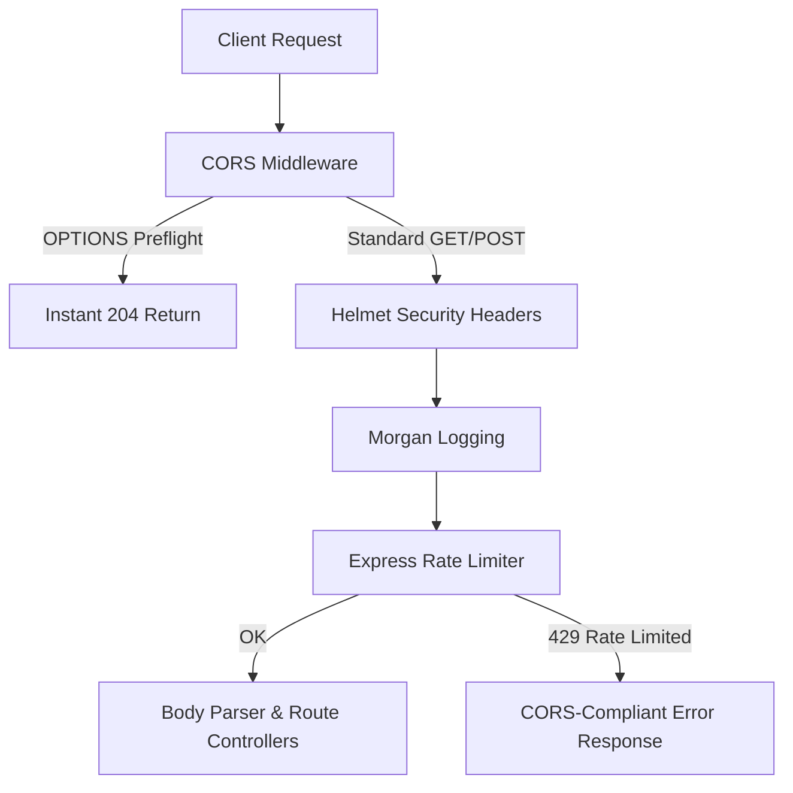

# ⚡ Sleek Shortener (MERN + Tailwind CSS v4 + daisyUI v5 + Docker)

An elite, high-performance, and aesthetics-driven **MERN URL Shortener** equipped with real-time analytics, secure QR code generation, and robust server-side security. Built using modern web standards (ES Modules, hardware-composited animations, and strict rate-limiting architectures).

Live Link: [Sleek Shortener Live Site](https://mern-url-shortener-0vyb.onrender.com)

---

## ✨ Features & Visual Excellence

* **🎨 Premium Glassmorphism UI**: High-end SaaS dashboard styled with standard Tailwind CSS v4, daisyUI v5, Google Outfit typography, and a hardware-accelerated CSS Grid Vector Mesh background (operating entirely on the GPU layer to prevent browser repaint lag).
* **📈 Live Analytics Modal**: Pulsing click counters, creation timestamp mapping, and copy-to-clipboard utilities tracking live request logs from the MongoDB cluster.
* **🛡️ ReDoS Immunity**: 100% resilient URL parsing engine using safe, non-nested regular expressions to block Catastrophic Backtracking regular expression vulnerabilities entirely.
* **🔒 CORS & Rate Limiter Security**: Properly configured express middleware sequence (CORS applied *before* the rate limiter) to eliminate preflight OPTIONS blocks and allow clients to handle HTTP `429 Too Many Requests` natively.
* **🔳 Customized QR Codes**: Generates high-definition, customizable QR codes instantly on link generation with native browser download triggers.
* **💾 Local Storage Dashboard**: Keeps track of your last 6 shortened URLs inside a cached state, safeguarded with strict, non-looping array parsing.
* **🐳 Containerized Dev/Prod Stacks**: Unified local environment setup via multi-stage Dockerfiles and `docker-compose.yml`, featuring persistent database storage volumes and hot-reloading.

---

## 🛠️ Technology Stack

| Layer | Technologies |
| :--- | :--- |
| **Frontend** | React, Vite, Tailwind CSS v4, daisyUI v5, Axios, QRCode.js |
| **Backend** | Node.js (ESM), Express, Mongoose, CORS, Helmet, Morgan, Express Rate Limit |
| **Containers** | Docker, Docker Compose (Multi-stage development/production workflows) |
| **Database** | MongoDB Atlas (Cloud Cluster) or local MongoDB (Containerized) |
| **Deployment** | Render Cloud Platform (Frontend Static, Web Service Backend API) |

---

## ⚙️ Project Structure

```text
├── backend/
│   ├── models/          # Mongoose Database Schemas
│   ├── routes/          # API Endpoint Controllers (/shorten, /stats, /:shortId)
│   ├── server.js        # Express application setup & middleware stack
│   └── package.json     # ESM node project declaration
│
└── frontend/
    ├── src/
    │   ├── App.jsx      # Heavy Glassmorphic Core Application
    │   ├── main.jsx     # Vite client entry point
    │   └── index.css    # Global Tailwind styling injections
    └── package.json     # Client package dependencies
```

---

## 🚀 Local Quickstart Guide

### 1. Prerequisites
Ensure you have **Node.js (v18+)** and **npm** installed on your workstation.

### 2. Configure Environment Variables

Create a `.env` file in the **backend** directory:
```env
PORT=5000
MONGO_URI=your_mongodb_atlas_connection_string
BASE_URL=http://localhost:5000
FRONTEND_URL=http://localhost:5173
```

Create a `.env` file in the **frontend** directory:
```env
VITE_BACKEND_URL=http://localhost:5000
```

### 3. Run Backend (Dev Mode)
```bash
cd backend
npm install
npm run dev
```
*The backend server will launch at `http://localhost:5000` connected to MongoDB.*

### 4. Run Frontend (Dev Mode)
In a new terminal window:
```bash
cd frontend
npm install
npm run dev
```
*The hot-reloaded development portal will open at `http://localhost:5173`.*

---

## 🐳 Running with Docker

You can run the entire stack using Docker and Docker Compose. This maps your local directories into the containers so you still get live hot-reloading during development.

### Prerequisites
Make sure you have [Docker Desktop](https://www.docker.com/products/docker-desktop/) installed on your machine.

### Quick Start (Development Mode)

1. **Verify Environment Files**:
   - `backend/.env` is read automatically by Docker Compose. If you want to connect to the local containerized MongoDB instead of Atlas, you can uncomment the `MONGO_URI` environment override under `backend` in [docker-compose.yml](file:///E:/URL_Shortener/docker-compose.yml).
   - `frontend/.env` should contain:
     ```env
     VITE_BACKEND_URL=http://localhost:5000
     ```

2. **Launch the Container Stack**:
   From the project root directory, run:
   ```bash
   docker-compose up --build
   ```

3. **Access the Portals**:
   - **Frontend Interface**: [http://localhost:5173](http://localhost:5173) (includes hot-reload enabled via folder polling)
   - **Backend API Server**: [http://localhost:5000](http://localhost:5000)

4. **Shutdown Containers**:
   ```bash
   docker-compose down
   ```

### Production Build

To build and package production-optimized containers:

1. **Backend Build**:
   ```bash
   docker build --target production -t sleek-shortener-backend ./backend
   ```

2. **Frontend Build** (served via Nginx, compiling the backend API endpoint at build time):
   ```bash
   docker build --target production --build-arg VITE_BACKEND_URL=http://localhost:5000 -t sleek-shortener-frontend ./frontend
   ```

---

## ☸️ Running with Kubernetes

You can orchestrate and run this application in a Kubernetes cluster (e.g., Minikube, Kind, or Docker Desktop Kubernetes) using the manifests in the [k8s/](file:///E:/URL_Shortener/k8s) folder.

### 1. Build and Tag Images
Before deploying, build the production Docker images so the cluster can load them:
```bash
# Build the Backend
docker build --target production -t sleek-shortener-backend:latest ./backend

# Build the Frontend (Ensure VITE_BACKEND_URL points to the NodePort mapping: http://localhost:30500)
docker build --target production --build-arg VITE_BACKEND_URL=http://localhost:30500 -t sleek-shortener-frontend:latest ./frontend
```

> [!TIP]
> If you are using Minikube, run `eval $(minikube -p minikube docker-env)` in your shell before building the images so Minikube can load them locally without pushing to a registry.

### 2. Deploy Manifests
Deploy the MongoDB database (with Persistent Volume), the API backend, and the React frontend:
```bash
kubectl apply -f k8s/
```

### 3. Verify Deployed Resources
Check that all Pods are running successfully and the services are active:
```bash
kubectl get all
```

### 4. Access the Application
The manifests expose services using NodePorts:
- **Frontend Portal**: [http://localhost:30080](http://localhost:30080)
- **Backend API**: [http://localhost:30500](http://localhost:30500)

> [!NOTE]
> If running on Minikube, use the command `minikube service frontend-service` and `minikube service backend-service` to open them directly, as port-binding routes can differ.

### 5. Cleaning Up
To delete all configurations, volumes, and workloads from your cluster:
```bash
kubectl delete -f k8s/
```

---

## 🛡️ Production & Security Auditing

### Middleware Sequence Order Flow
To ensure 100% stable communication across cross-origin interfaces, the Express app implements the following security pipeline:



### Regular Expression Analysis (ReDoS Guard)
The application completely rejects typical nested wildcard patterns (e.g. `(a+)+`) inside input validators. The validated TLD pattern resolves inputs linearly under 1 microsecond:
```javascript
const pattern = /^(https?:\/\/)?([\w.-]+)\.([a-z]{2,12})(\/.*)?$/i;
```

---

## 🤝 Contributing

Contributions, issues, and feature requests are welcome. Feel free to open a pull request or report issues to optimize performance further!

*Designed for Velocity and Visual Excellence.*
